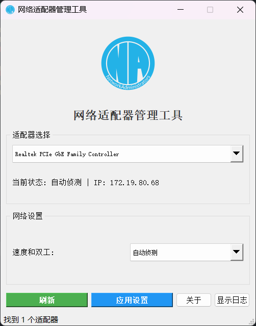
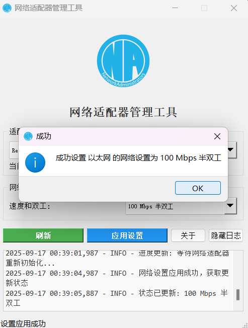

# [网络适配器管理工具](https://github.com/CurtisYan/NetAdapterTool)

Windows系统网络适配器速度和双工模式管理工具，支持图形化界面操作。为NA（广软网协）而做

## 示例截图

 

## 功能特性

本工具提供现代化的图形界面，支持查看和管理Windows系统中的网络适配器设置，包括实时显示网络速度、双工模式和IP地址信息，具备自动权限检测和多线程处理能力，确保操作流畅不卡顿。

### 🔧 核心功能
- **网络适配器管理** - 查看和修改网络适配器速度和双工模式
- **实时状态显示** - 显示IP地址、连接状态和网络速度
- **智能过滤** - 支持仅显示有线网卡，过滤无线适配器
- **多线程处理** - 后台操作，界面响应流畅

### 🌐 系统兼容性
- **Windows版本支持** - Windows 7/8/10/11 (32位/64位)
- **PowerShell兼容** - 支持PowerShell 5.x 和 PowerShell 7.x
- **多路径检测** - 自动检测系统中可用的PowerShell版本
- **WMI兼容性** - 智能WMI连接管理，支持多线程环境
- **权限管理** - 多种管理员权限检测方法，自动提权

### 🛡️ 健壮性设计
- **系统诊断** - 内置兼容性检查和诊断工具
- **错误恢复** - 智能错误处理和降级方案
- **资源管理** - 支持多种部署方式（源码/打包exe）
- **日志系统** - 详细的操作日志和错误追踪

## 快速开始

### 方式1：直接运行Python脚本

#### 安装依赖
```bash
pip install -r requirements.txt
```

#### 运行程序
```bash
# 标准运行方式（显示控制台）
python gui.py

# 无控制台运行方式（推荐）
python gui_no_console.pyw
# 或者直接双击 gui_no_console.pyw 文件
```

**注意**：需要以管理员身份运行命令行或IDE

### 方式2：使用一键打包脚本 ⭐ **推荐**

#### 安装打包工具
```bash
pip install pyinstaller
```

#### 一键打包
```bash
# 双击运行或在命令行执行
build.bat
```

打包完成后会生成 `NetAdapterTool.exe`，该程序：
- ✅ **自动请求管理员权限** - 无需手动设置
- ✅ **独立运行** - 无需安装Python环境  
- ✅ **防杀毒误报** - 符合Windows安全规范
- ✅ **一键启动** - 双击即可使用


## 注意事项

### 开发环境
❗ 以管理员身份运行Python脚本或IDE

### 生产环境  
✅ 使用打包后的exe文件，会自动请求管理员权限

## 打包说明

### 打包脚本功能
`build.bat` 脚本会自动：
1. 使用PyInstaller打包工具
2. 生成带控制台窗口的调试版本
3. 自动请求管理员权限
4. 包含所有必要的依赖项和资源文件

### 打包参数说明
- `--onefile`: 生成单个exe文件
- `--console`: 显示控制台窗口（便于调试）
- `--uac-admin`: 自动请求管理员权限
- `--icon`: 添加程序图标
- `--add-data`: 包含资源文件

#### 手动配置管理员权限
对于其他打包工具，需要创建应用程序清单文件来请求管理员权限。

## 故障排除

### 常见问题
1. **WMI连接失败** → 确保以管理员身份运行
2. **PowerShell超时** → 检查系统负载和PowerShell版本
3. **找不到适配器** → 检查网络适配器驱动是否正常

### 技术支持
- 查看程序日志（点击"显示日志"按钮）
- 使用系统诊断功能（帮助菜单）
- 检查Windows事件查看器
- 确认WMI服务正常运行

## 许可证

MIT License
